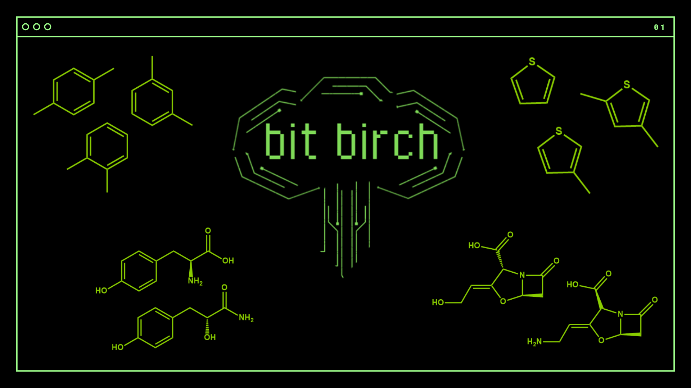

# BitBirch: Efficient Clustering of Large Molecular Libraries

**Miranda-Quintana Group**  
*University of Florida*



**NOTE**: For our cutting-edge, API-compatible, fast and memory-efficient implementation
of the BitBIRCH algorithm for huge molecular libraries check out the [BitBirch-Lean
(bblean)](https://github.com/mqcomplab/bblean) repository.

## Reference  

[DOI: 10.1039/D5DD00030K](https://doi.org/10.1039/D5DD00030K)

## Installation  

```bash
git clone https://github.com/mqcomplab/bitbirch.git
cd bitbirch
pip install -e .
```
